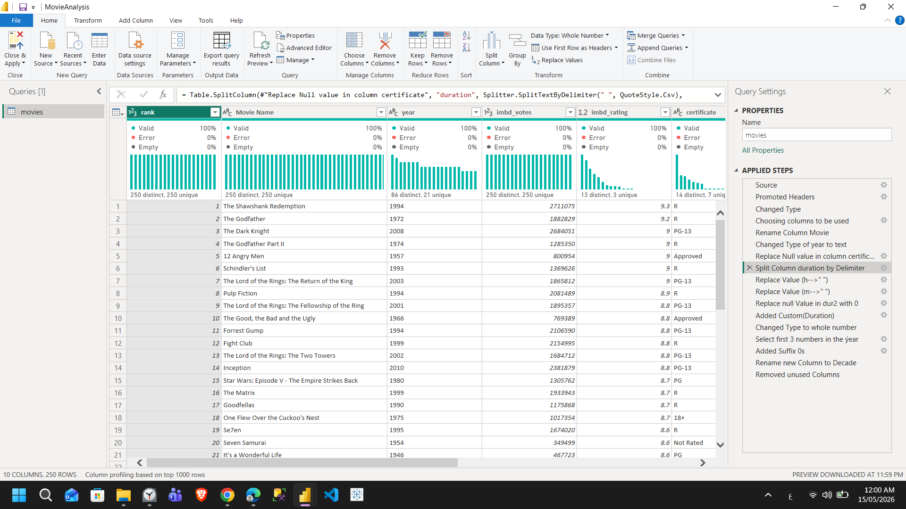
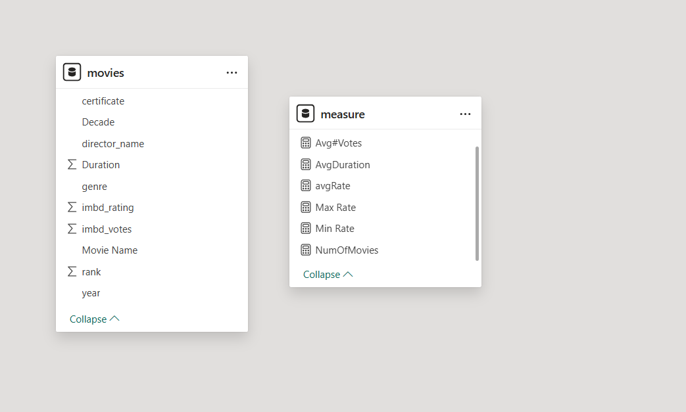
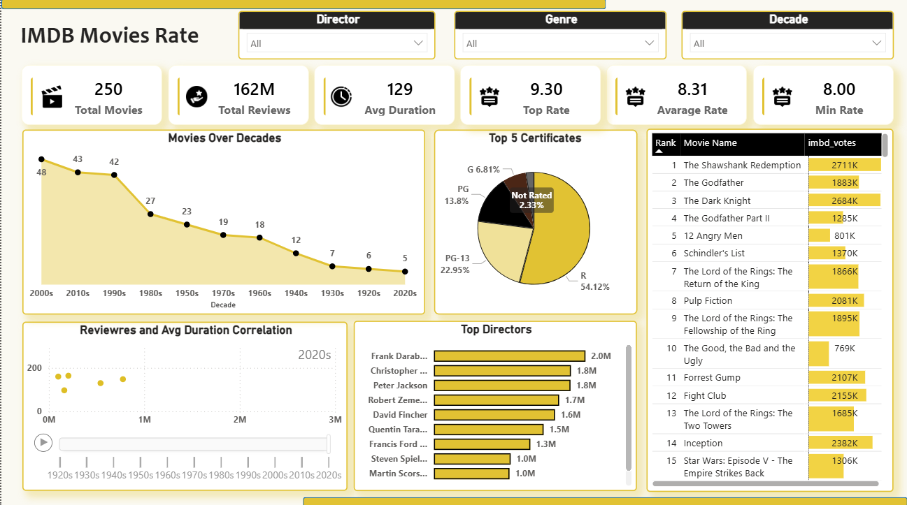

# IMDb Movies Analysis Dashboard 🎬

## Introduction
This project is an interactive Power BI dashboard built to analyze IMDb Top Rated Movies and uncover insights related to movie ratings, popularity, directors, certificates, and movie trends across different decades.

The dashboard focuses on transforming raw movie data into meaningful visual insights using Power Query for data cleaning and Power BI for visualization and storytelling.

### Project Goals
- Analyze highly rated IMDb movies
- Identify trends across decades
- Understand relationships between ratings, reviews, and movie duration
- Highlight the most influential directors and movies
- Build an interactive and visually engaging dashboard

---

# Dataset Information

The dataset was collected from IMDb Top Rated Movies:

🔗 https://www.imdb.com/chart/top/

The dataset contains information about:
- Movie names
- Ratings
- Number of votes/reviews
- Duration
- Release years
- Directors
- Genres
- Certificates

The analysis focuses on **250 top-rated movies** from IMDb.

---

# Data Cleaning & Transformation (Power Query)

The dataset required several preprocessing and transformation steps before visualization.

## Main Cleaning Steps

### Handling Missing Values
- Null values were identified and replaced to avoid calculation issues and improve dashboard accuracy.

### Duration Column Transformation
The movie duration column originally contained text values such as:
- `2h 30m`
- `1h`
- `45m`

The column was cleaned by:
- Splitting values using delimiters
- Removing text characters (`h` and `m`)
- Replacing null values with `0`
- Converting the column into numeric format

This transformation enabled accurate calculations for:
- Average Duration
- Correlation Analysis

### Year & Decade Transformation
The release year column was transformed into decades such as:
- 1990s
- 2000s
- 2010s

This helped create better time-based analysis and trend visualization.

---

# Data Model

The project uses a simple data model since the dataset structure was already organized and manageable within a single main table.

Only the required columns were kept to improve:
- Performance
- Dashboard responsiveness
- Data organization

---

# Dashboard Overview

The dashboard provides a complete overview of IMDb Top Rated Movies through interactive visualizations and KPIs.

It allows users to analyze:
- Ratings
- Reviews
- Movie duration
- Directors
- Certificates
- Trends across decades

---

# Dashboard Preview

## Dashboard

---

# Dashboard KPIs

| KPI | Value |
|---|---|
| Total Movies | 250 |
| Total Reviews | 162M |
| Average Duration | 129 Minutes |
| Top Rating | 9.30 |
| Average Rating | 8.31 |
| Minimum Rating | 8.00 |

---

# Analysis & Insights

## 1. Movies Over Decades

The analysis shows that:
- The **2000s** contain the highest number of top-rated movies.
- The **2010s** and **1990s** also have strong representation.

### Insight
Modern cinema dominates the IMDb Top Rated list due to:
- Higher global reach
- Increased audience engagement
- Larger online review activity

At the same time, the 1990s remain one of the strongest cinematic eras with iconic movies such as:
- Fight Club
- Pulp Fiction
- The Shawshank Redemption

---

## 2. Certificates Analysis

The certificate distribution revealed that:

- **R Rated movies represent 54.12%** of the dataset.
- **PG-13 represents 22.95%**.

### Insight
Movies targeted toward mature audiences tend to achieve:
- Higher ratings
- Stronger storytelling
- Greater emotional and dramatic depth

---

## 3. Top Directors Analysis

The dashboard highlights some of the most influential directors, including:
- Frank Darabont
- Christopher Nolan
- Peter Jackson
- David Fincher
- Quentin Tarantino

### Insight
The director plays a major role in movie success.

Highly recognized directors consistently produce movies with:
- Strong audience engagement
- High ratings
- Large review counts

---

## 4. Top Ranked Movies

Some of the highest ranked movies include:
- The Shawshank Redemption
- The Godfather
- The Dark Knight
- Inception
- Fight Club
- The Lord of the Rings trilogy

### Insight
The most successful movies often share:
- Strong storytelling
- Emotional depth
- Memorable characters
- High rewatch value

---

## 5. Reviews & Duration Correlation

A scatter plot with Play Axis animation was used to analyze the relationship between:
- Movie duration
- Number of reviews/votes
- Decades over time

Each point represents a movie, while the motion across decades helps visualize how audience engagement evolved historically.

### Insight
The analysis shows a slight positive correlation between movie duration and audience engagement.

Movies with higher review counts tend to have moderately longer durations, especially in:
- Epic movies
- Fantasy movies
- Drama films

Using the Decade Play Axis added a dynamic storytelling experience by showing how movie trends changed across different cinematic eras.

---

# Interactive Features

The dashboard includes interactive filters for:
- Director
- Genre
- Decade

These slicers help users dynamically explore the data and customize the analysis experience.

---

# Tooltip Feature

A custom tooltip using a **Gauge Chart** was implemented to display movie ratings interactively.

This improves:
- User experience
- Visual storytelling
- Data exploration

by allowing users to quickly evaluate movie ratings while hovering over visuals.

---

# Recommendations

Based on the analysis, several recommendations can be made:

- Focus on strong storytelling and cinematic depth
- Invest in highly recognized directors
- Analyze audience preferences across genres
- Explore successful patterns from the 1990s and 2000s
- Build more advanced recommendation systems using ratings and reviews

---

# Tools & Technologies

- Power BI
- Power Query
- DAX
- Data Visualization
- Data Cleaning & Transformation

---

# Conclusion

This project demonstrates how raw movie data can be transformed into meaningful business insights through data cleaning, visualization, and interactive analysis.

The dashboard provides a clear understanding of:
- Audience preferences
- Movie success patterns
- Director influence
- Historical cinema trends

while delivering an engaging and interactive analytical experience.

---

## 👩‍💻 Author

**Yomna Ahmed Hamdy**  
Data Analyst